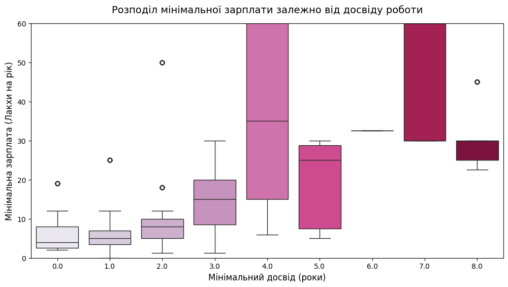
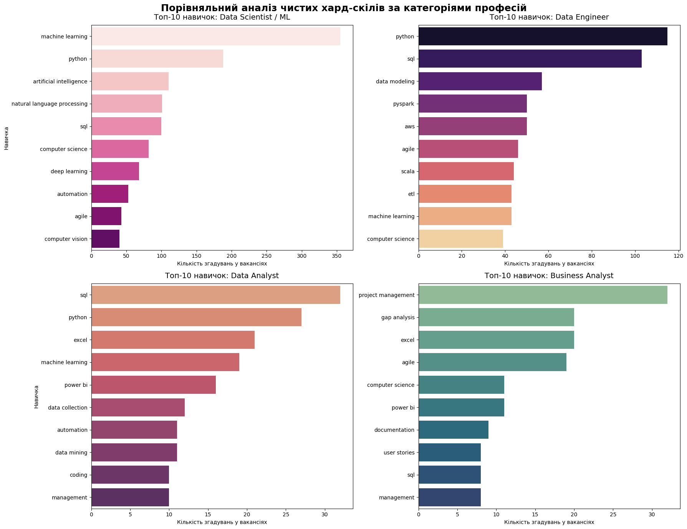
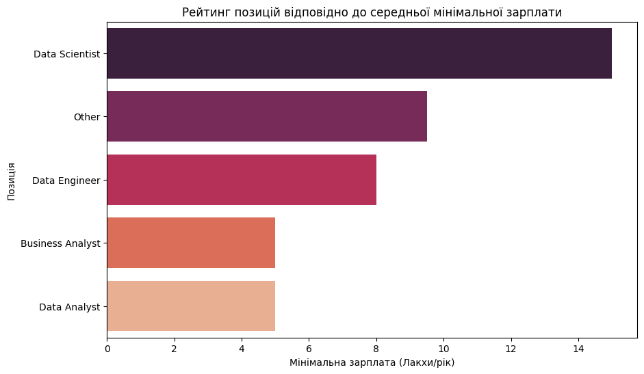

# Аналіз ринку праці та хард-скілів у сфері Data Science (2025 рік)

## Опис проєкту
Цей проєкт присвячений детальному дослідженню та аналізу вакансій у сфері роботи з даними (Data Science, Data Engineering, Business & Data Analysis) на індійському ринку праці. 
Мета дослідження: виявити ключові тренди, закономірності у зарплатах, актуальні технологічні стеки та визначити, хто є основним гравцем на ринку праці.

## Опис датасету
**Мета проєкту:** аналіз трендів ринку праці Data Science в Індії (2025 рік).
**Джерело даних:** датасет вакансій із зазначенням зарплат, вимог до досвіду роботи та стеків навичок. 
**Обсяг вибірки:** понад 7000 вакансій.

**Основні метрики датасету:**
- *Job Title* - назва посади.
- *Company Name* - назва компанії (роботодавець).
- *Location* - локація (міста в Індії).
- *Experience* - досвід роботи, який вимагається.
- *Salary* - зарплатна вилка для вказаної посади (у Лакхах на рік).
- *Job Description* - опис роботи (графік, умови тощо).
- *Skills* - навички, що вимагаються.

Переведення національної валюти Індії в долари: 
- 1 Лакх = 100 000 рупій;
- 1 долар = 83-85 індійських рупій;
- 1 Лакх = 1,200 доларів на рік.

## Етапи роботи з даними:
1. **Data Cleaning:** Очищення від порожніх значень, обробка нетипових текстових записів у фінансових колонках (`Unpaid`, `Not disclosed`).
2. **Feature Engineering:** Конвертація заробітних плат у єдиний стандарт — Лакхи на рік. Виділення мінімального/максимального досвіду та зарплати.
3. **Категоризація (NLP/Regex):** Реалізація коду для поділу посад на загальну категорії професій: *Data Scientist, Data Engineer, Data Analyst, Business Analyst*.
4. **Текстовий аналіз навичок:** Очищення списку вимог від абстрактних слів-дублікатів (`analytical`, `data science`) та виділення чистих хард-скілів.

## 📉 Головні інсайти та візуалізація

### 1. Зв'язок між досвідом та стартовою зарплатою
За результатами перевірки розподілу на нормальність методом **Шапіро-Уілка** було обрано коефіцієнт **кореляції Спірмена**. 
* **Результат:** Коефіцієнт кореляції становить **0.681**, що свідчить про сильний, статистично значущий позитивний зв'язок між досвідом та пропонованою оплатою.

### 2. Топ хард-навичок за категоріями професій

* **Must-have стек:** SQL та Python є обов'язковими для всіх ролей.
* **Спеціалізація:** Data Engineer/Data Scientist фокусується на алгоритмах ШІ (AI, Machine Learning), для Data Analyst спеціалістів також є потреба у освоєні Excel та Power BI, які допомагають швидко перетворювати сирі дані на бізнес-звіти.
Business ANalyst є найменш технічною роллю, тому найбільший фокус падає на проджект менеджмент, комунікацію та розуміння управління процесами, а серед інструментів лідирують ті самі Excel та Power BI.

### 3. Фінансовий аналіз напрямів (Медіанна зарплата)
Для аналізу фінансової сторони було використано **медіану**, оскільки вона стійка до викидів та екстремальних значень.

* Напрям **Data Scientist** є абсолютним фінансовим лідером ринку.
* **Data Analyst** та **Business Analyst** мають ідентичний медіанний рівень стартових пропозицій.

## Висновок
Цей проєкт є розвідуальним аналізом ринку праці у сфері даних на основі вибірки з понад 7000 вакансій. Було проведено повний цикл підготовки даних: від очищення фінансових/числових показників, обробки аномалій до аналізу та категоріального моделювання ролей на ринку.
Можемо зробити висновки:
- кореляція між зарплатою та досвідом роботи: кожні додаткові кілька років комерційного досвіду гарантуються приріст у стартовій ставці, що робить інвестиції у підвищення кваліфікації фінансово виправданими.
- ієрархія професій за популярністю та фінансовим потенціалом: Data Scientist — є абсолютним лідером за рівнем доходів, суттєво випереджаючи інші позиції. Складність алгоритмів штучного інтелекту безпосередньо конвертується в найвищу фінансову цінність для бізнесу. Data Engineer — посідає впевнене друге місце. Попит на побудову стабільної архітектури даних оцінюється вище за класичну аналітику. Data Analyst та Business Analyst — замикають рейтинг, демонструючи абсолютно ідентичний медіанний рівень оплати праці. Вони формують чудову «вхідну точку» в індустрію з меншим технічним порогом.
- актуальний технологічний стек на ринку праці: маст-хевом виступає SQL та Python для будь-якої ролі в роботі з даними, для аналітичних позицій (Data/Business Analyst) ключовим є вміння перетворювати дані на рішення за допомогою Excel, Power BI та методологій управління проєктами (Agile, Project Management).

